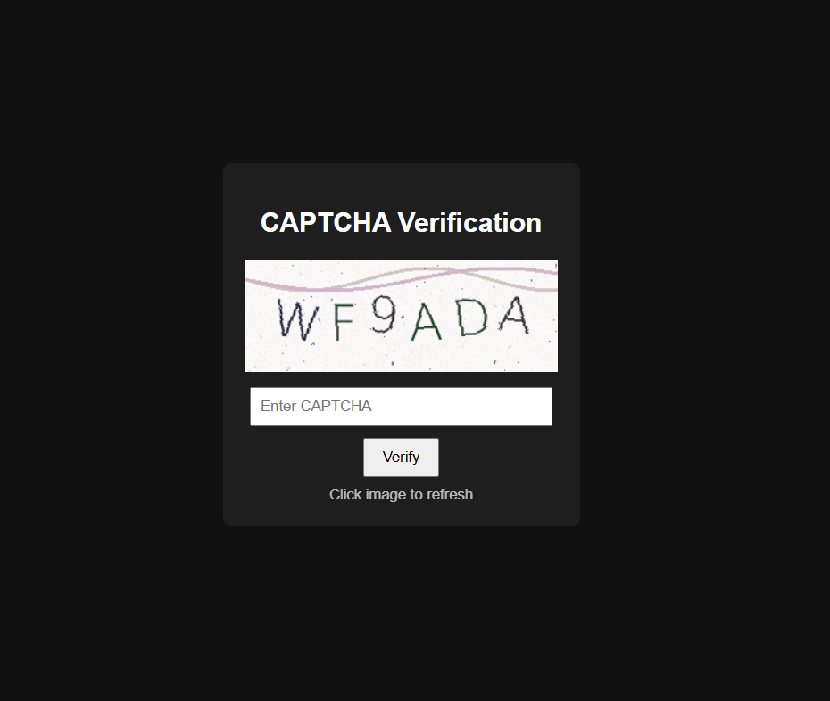

# CAPTCHA Generator – Actix Web Example Usage

This document shows how to use the **`captcha-generator`** crate with **Actix Web** to build a complete CAPTCHA system with:

- CAPTCHA image generation  
- Session-based CAPTCHA validation  
- Simple HTML frontend demo  

---

## 📁 Project Structure

```
example/
├── Cargo.toml
├── src/
│   └── main.rs
└── index.html
```

---

## 📦 Dependencies (`Cargo.toml`)

```toml
[package]
name = "example"
version = "0.1.0"
edition = "2024"

[dependencies]
actix-web = "4"
captcha-generator = "0.1"
actix-session = { version = "0.9", features = ["cookie-session"] }
serde = { version = "1", features = ["derive"] }
```

---

## 🚀 Server Code (`main.rs`)

```rust
use actix_session::{Session, SessionMiddleware};
use actix_web::{
    cookie::Key,
    get, post,
    web, App, HttpResponse, HttpServer, Responder,
};
use captcha_generator::Captcha;
use serde::Deserialize;

#[get("/")]
async fn index() -> impl Responder {
    HttpResponse::Ok()
        .content_type("text/html")
        .body(include_str!("index.html"))
}

#[get("/captcha")]
async fn captcha(session: Session) -> impl Responder {
    let captcha = Captcha::new();

    // Store captcha code in session
    session.insert("captcha_code", &captcha.code).unwrap();

    match captcha.to_png_bytes() {
        Ok(png) => HttpResponse::Ok()
            .content_type("image/png")
            .body(png),
        Err(_) => HttpResponse::InternalServerError()
            .body("Failed to generate CAPTCHA"),
    }
}

#[derive(Deserialize)]
struct CaptchaForm {
    captcha: String,
}

#[post("/verify")]
async fn verify(form: web::Form<CaptchaForm>, session: Session) -> impl Responder {
    let stored: Option<String> = session.get("captcha_code").unwrap();

    match stored {
        Some(code) if code.eq_ignore_ascii_case(&form.captcha) => {
            HttpResponse::Ok().body("CAPTCHA verified successfully!")
        }
        _ => HttpResponse::Ok().body("Invalid CAPTCHA"),
    }
}

#[actix_web::main]
async fn main() -> std::io::Result<()> {
    let secret_key = Key::generate();

    println!("Server running at http://127.0.0.1:8080");

    HttpServer::new(move || {
        App::new()
            .wrap(SessionMiddleware::new(
                actix_session::storage::CookieSessionStore::default(),
                secret_key.clone(),
            ))
            .service(index)
            .service(captcha)
            .service(verify)
    })
    .bind(("127.0.0.1", 8080))?
    .run()
    .await
}
```

---

## 🎨 Frontend Demo (`index.html`)

```html
<!DOCTYPE html>
<html lang="en">
<head>
    <meta charset="UTF-8">
    <title>CAPTCHA Demo</title>
</head>
<body>
    <h2>CAPTCHA Verification</h2>
    
    <form action="/verify" method="post">
        <input type="text" name="captcha" placeholder="Enter CAPTCHA" required />
        <button type="submit">Verify</button>
    </form>
</body>
</html>
```

---

## ▶️ Running the Example

```bash
cargo run
```

Open your browser:

```
http://127.0.0.1:8080
```

## CAPTCHA Demo

 

---

## ✅ Features Demonstrated

- PNG CAPTCHA generation  
- Session-based CAPTCHA validation  
- Actix Web integration  
- Simple HTML frontend  

---

This example can be used as a base for login, signup, or form verification flows.
